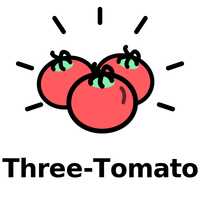

<p align="center">
  
</p>

# Three-Tomato 三个番茄

> 将需求文档转换为多端**原生**开发代码：Android、iOS、鸿蒙、小程序、快应用、H5、Web、Mac、Windows 🚀

[📖 English](README.md) · [🐛 报告问题](https://github.com/trsoliu/three-tomato/issues) · [✨ 功能建议](https://github.com/trsoliu/three-tomato/issues)

## ✨ 什么是 Three-Tomato？

Three-Tomato 是一个与 [skills.sh](https://skills.sh) 兼容的技能包，让 AI Agent 能够分析需求文档，并为多个平台生成**原生**开发代码。

**核心理念**：原生优先，AI 友好技术栈（数据集大、文档丰富）

### 💡 使用前

```
📝 PRD 需求文档
     ↓
👨‍💻 Android 开发 → Android 代码
👨‍💻 iOS 开发 → iOS 代码  
👨‍💻 小程序开发 → 小程序代码
👨‍💻 H5 开发 → H5 代码
     ↓
🔄 手动同步数据模型、API、业务逻辑...
😰 不一致、Bug、延期...
```

### 🎉 使用后

```
📝 PRD 需求文档
     ↓
🤖 AI Agent + Multi-Platform Transformer
     ↓
✅ Android 代码 (Kotlin + Compose)
✅ iOS 代码 (Swift + SwiftUI)
✅ 鸿蒙代码 (ArkTS + ArkUI)
✅ 微信小程序
✅ 支付宝小程序
✅ 百度智能小程序
✅ 快应用
✅ H5/Web (Vue/React)
✅ Flutter / React Native / Uni-app / Taro
     ↓
🎯 一致的数据模型、API、业务逻辑！
```

## 🚀 快速开始

### 安装

```bash
# 使用 npx
npx skills add trsoliu/three-tomato

# 或直接克隆
git clone https://github.com/trsoliu/three-tomato.git
```

### 使用

告诉你的 AI Agent：

```
🤖 "生成多端代码"
🤖 "转换为安卓代码"
🤖 "将需求转换为微信小程序"
🤖 "transform to ios"
```

### 更新

```bash
npx skills update trsoliu/three-tomato
```

## 📱 支持的平台

| 平台 | 代码 | 技术栈 |
|------|------|--------|
| Android | `android` | Kotlin, Compose, MVVM, Hilt |
| iOS | `ios` | Swift, SwiftUI, MVVM, Combine |
| 鸿蒙 HarmonyOS | `harmony` | ArkTS, ArkUI, MVVM |
| 微信小程序 | `wechat-mp` | TypeScript, 原生/Taro/Uni-app |
| 支付宝小程序 | `alipay-mp` | TypeScript, 原生/Taro/Uni-app |
| 百度智能小程序 | `baidu-mp` | TypeScript, 原生/Taro/Uni-app |
| 快应用 | `quick-app` | TypeScript |
| H5/移动Web | `h5` | Vue 3/React, Vant/Antd Mobile |
| Flutter | `flutter` | Dart, BLoC/Riverpod |
| React Native | `react-native` | TypeScript, Redux/MobX |
| Uni-app | `uni-app` | Vue 3, TypeScript |
| Taro | `taro` | React/Vue 3, TypeScript |

## 🔌 插件系统

### 插件命令

```
📋 "列出插件"
📦 "安装插件 <来源>"
✅ "启用插件 <名称>"
❌ "禁用插件 <名称>"
```

### 内置插件

**平台生成器：**
- `android-generator` - Android 原生代码生成
- `ios-generator` - iOS 原生代码生成
- `harmony-generator` - 鸿蒙代码生成
- `wechat-mp-generator` - 微信小程序生成
- `alipay-mp-generator` - 支付宝小程序生成
- `baidu-mp-generator` - 百度智能小程序生成
- `quick-app-generator` - 快应用生成
- `h5-generator` - H5/Web 生成
- `flutter-generator` - Flutter 生成
- `rn-generator` - React Native 生成
- `uni-app-generator` - Uni-app 生成
- `taro-generator` - Taro 生成

**工具类：**
- `api-sync` - 跨平台 API 定义同步
- `ui-converter` - UI 组件转换
- `i18n-sync` - 国际化资源同步
- `diff-report` - 平台差异报告

## 📁 输出结构

```
.three-tomato/
├── config.yaml              # 配置文件
├── requirements/            # 输入需求
│   ├── PRD.md              # 产品需求文档
│   └── api.yaml            # API 规范
├── output/                  # 生成的代码
│   ├── android/
│   ├── ios/
│   ├── harmony/
│   ├── wechat-mp/
│   ├── h5/
│   └── _shared/            # 共享资源
├── reports/                 # 分析报告
└── cache/                   # 增量缓存
```

## 🏗️ Skill 结构

```
three-tomato/
├── SKILL.md                 # 主指令文件
├── three-tomato.skill
├── assets/                  # 配置模板
├── docs/                    # 文档
├── plugins/                 # 插件目录
│   ├── _registry.yaml
│   ├── android-generator/
│   ├── ios-generator/
│   └── ...
├── references/              # 提示词和模板
└── scripts/                 # Python 工具
```

## ⚙️ 配置

编辑 `.three-tomato/config.yaml`：

```yaml
# 启用的平台
platforms:
  enabled:
    - android
    - ios
    - wechat-mp
    - h5

# 技术栈配置
tech_stack:
  android:
    language: kotlin           # kotlin | java
    architecture: mvvm         # mvvm | mvp | mvi
    ui: compose               # compose | xml
    
  ios:
    language: swift           # swift | objc
    ui: swiftui               # swiftui | uikit
    
  wechat-mp:
    framework: native         # native | taro | uni-app
    language: typescript
    
  h5:
    framework: vue3           # vue3 | react
    ui: vant                  # vant | antd-mobile

# 输出配置
output:
  include_tests: true         # 是否生成测试
  include_docs: true          # 是否生成文档
  language: zh-CN             # 注释语言
```

## ❓ 常见问题

**Q: 更新 skill 会影响我已生成的代码吗？**

不会。更新只会更新 skill 本身，不会修改你生成的代码。使用 `"重新生成代码"` 来更新代码。

**Q: 我可以自定义生成的代码吗？**

可以。使用 `<!-- user-content -->` 标记的内容会在重新生成时保留。

**Q: 如何添加新平台支持？**

参考 [插件指南](docs/plugins.md) 创建自定义插件。

**Q: 生成的代码质量如何？**

生成的代码遵循各平台的最佳实践，包含完整的项目结构、错误处理和文档注释。

## 🙏 灵感来源

- [mini-wiki](https://github.com/trsoliu/mini-wiki)
- [DeepWiki](https://github.com/AsyncFuncAI/deepwiki-open)

## 📄 许可证

本项目使用 [MIT 许可证](LICENSE)。

## 💬 联系方式

用 ❤️ 制作 by three-tomato

微信: trsoliu
