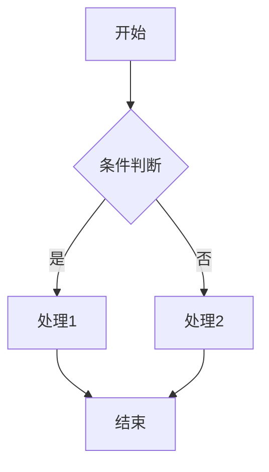

# 需求文档模板 / Requirement Document Template

## 1. 概述 / Overview

### 1.1 项目背景
<!-- 描述项目的背景和目标 -->

### 1.2 目标用户
<!-- 描述目标用户群体 -->

### 1.3 核心价值
<!-- 描述产品的核心价值主张 -->

---

## 2. 功能需求 / Functional Requirements

### 2.1 功能清单

| 功能模块 | 功能名称 | 优先级 | 状态 |
|---------|---------|--------|------|
| 用户模块 | 登录注册 | P0 | 待开发 |
| | | | |

### 2.2 功能详情

#### 2.2.1 [功能名称]

**功能描述**：
<!-- 详细描述功能 -->

**业务规则**：
- 规则1
- 规则2

**输入/输出**：
- 输入：
- 输出：

**异常处理**：
- 异常场景1 → 处理方式
- 异常场景2 → 处理方式

---

## 3. 界面设计 / UI Design

### 3.1 页面清单

| 页面名称 | 路由 | 描述 |
|---------|------|------|
| 首页 | /home | 应用首页 |
| | | |

### 3.2 页面详情

#### 3.2.1 [页面名称]

**页面布局**：
```
┌─────────────────────────────┐
│         Header              │
├─────────────────────────────┤
│                             │
│         Content             │
│                             │
├─────────────────────────────┤
│         Footer/TabBar       │
└─────────────────────────────┘
```

**组件列表**：
- 组件1: 描述
- 组件2: 描述

**交互说明**：
- 点击xxx → 跳转到yyy
- 下拉 → 刷新数据

---

## 4. 数据模型 / Data Models

### 4.1 实体定义

#### User 用户

| 字段名 | 类型 | 必填 | 描述 |
|--------|------|------|------|
| id | string | Y | 用户ID |
| username | string | Y | 用户名 |
| avatar | string | N | 头像URL |
| createdAt | datetime | Y | 创建时间 |

### 4.2 枚举定义

#### UserStatus 用户状态

| 值 | 描述 |
|----|------|
| active | 正常 |
| inactive | 未激活 |
| banned | 禁用 |

---

## 5. API 接口 / API Specifications

### 5.1 接口清单

| 接口名称 | 方法 | 路径 | 描述 |
|---------|------|------|------|
| 用户登录 | POST | /api/v1/auth/login | 用户登录接口 |
| | | | |

### 5.2 接口详情

#### 5.2.1 用户登录

**基本信息**：
- 方法: `POST`
- 路径: `/api/v1/auth/login`
- 认证: 无需认证

**请求参数**：
```json
{
  "username": "string",
  "password": "string"
}
```

**响应数据**：
```json
{
  "code": 0,
  "message": "success",
  "data": {
    "token": "string",
    "user": {
      "id": "string",
      "username": "string"
    }
  }
}
```

**错误码**：
| 错误码 | 描述 |
|--------|------|
| 10001 | 用户名或密码错误 |
| 10002 | 账号已被禁用 |

---

## 6. 业务流程 / Business Flows

### 6.1 [流程名称]



---

## 7. 非功能需求 / Non-Functional Requirements

### 7.1 性能要求
- 页面加载时间 < 2s
- 接口响应时间 < 500ms
- 支持并发用户数: 1000+

### 7.2 安全要求
- 数据传输加密 (HTTPS)
- 敏感信息脱敏
- 登录态有效期: 7天

### 7.3 兼容性要求
- Android: 7.0+
- iOS: 13.0+
- 微信小程序基础库: 2.20.0+
- 浏览器: Chrome 80+, Safari 13+

---

## 8. 平台特殊需求 / Platform-Specific Requirements

### 8.1 Android 特殊需求
- 需要权限：存储、相机、定位
- 支持 Widget
- 需要适配折叠屏

### 8.2 iOS 特殊需求
- 支持 Face ID/Touch ID
- 需要适配刘海屏
- 支持 iPad

### 8.3 小程序特殊需求
- 分享卡片
- 小程序码
- 订阅消息

### 8.4 H5 特殊需求
- SEO 优化
- PWA 支持
- 分享到社交媒体

---

## 9. 附录 / Appendix

### 9.1 术语表
| 术语 | 解释 |
|------|------|
| | |

### 9.2 参考文档
- [参考文档1](url)
- [参考文档2](url)

### 9.3 修订历史
| 版本 | 日期 | 修改人 | 修改内容 |
|------|------|--------|----------|
| 1.0 | 2025-01-29 | xxx | 初始版本 |
